  

 

## Technologies

### Frontend

  
  &nbsp;&nbsp;
  
  &nbsp;&nbsp;
  
  &nbsp;&nbsp;
  
  &nbsp;&nbsp;
  
  &nbsp;&nbsp;
  
  &nbsp;&nbsp;
  
  &nbsp;&nbsp;
  

### Backend

  
  &nbsp;&nbsp;
  
  &nbsp;&nbsp;
  
  &nbsp;&nbsp;
  

### Databases

  
  &nbsp;&nbsp;
  
  &nbsp;&nbsp;
  

### Tools

  
  &nbsp;&nbsp;
  
  &nbsp;&nbsp;
  

